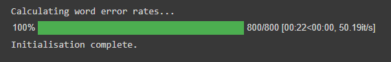

# Word accuracy calculator

A Python class for calculating word accuracy for the outputs of feature restoration models against reference strings.

## Getting started

### 1. Clone the repository

Recommended method for Google Colab notebooks:

```python
import sys
# Delete word-accuracy-calculator folder to ensures that any changes to the repo are reflected
!rm -rf 'word-accuracy-calculator'
# Clone word-accuracy-calculator repo
!git clone https://github.com/ljdyer/word-accuracy-calculator.git
# Add word-accuracy-calculator to PYTHONPATH
sys.path.append('word-accuracy-calculator/src')
```

### 2. Install requirements

If working in Google Colab, the only library you need to install is jiwer

```python
!pip install jiwer
```

If working in a virtual environment, run the following in the src directory:

```python
pip install -r requirements.txt
```

:warning: You may not be able to install jiwer if you do not have Microsoft Visual C++ 14.0 installed on your computer. This is not an issue if working in Google Colab.

### 3. Import WordAccuracyCalculator class

```python
from wac_main import WordAccuracyCalculator
```

## How to use

See also [WordAccuracyCalculator_Example.ipynb](src/WordAccuracyCalculator_Example.ipynb) for example usage.

### Initializing a class instance

```python
# ====================
class WordAccuracyCalculator:

    # ====================
    def __init__(self,
                 reference: Str_or_List_or_Series,
                 hypothesis: Str_or_List_or_Series,
                 calculate_wer_on_init: bool = True):
        """
        Initialize an instance of the WordAccuracyCalculator class

        Required arguments:
        -------------------
        reference:                  Either a single string, or a list or
            Str_or_List_or_Series   pandas.Series object of strings
                                    ('documents') to use as the reference
                                    corpus.
        hypothesis:                 Either a single string, or a list or
            Str_or_List_or_Series   pandas.Series object of strings
                                    ('documents') to use as the hypothesis
                                    corpus.
                                    (Number of documents must be the same
                                    as reference.)

        Optional keyword arguments:
        ---------------------------
        calculate_wer_on_init:      Whether or not to calculate word accuracy
            bool                    for all reference/hypothesis documents
                                    on intiialization. Set to false and access
                                    manually to save time if only looking at
                                    metrics for a subset of documents in a
                                    large corpus.
        """
```

#### Example usage:

```python
RESULTS_DF_PATH = 'drive/MyDrive/Group Assignment/Results/end_to_end.csv'
results_df_csv = pd.read_csv(RESULTS_DF_PATH)
reference = results_df_csv['reference']
hypothesis = results_df_csv['model_5_result']
wac_TED = WordAccuracyCalculator(reference, hypothesis)
```

</img>

### Displaying word accuracy

```python
    # ====================
    def show_metrics(self, doc_idx: Int_or_Str = 'all'):
        """
        Show minimum edit distance, reference length, and word accuracy
        for either a single document or the entire corpus.

        Optional keyword arguments:
        ---------------------------
        doc_idx: Int_or_Str         Either an integer indicating the index of
                                    the document to show metrics for, or 'all'
                                    to show metrics for all documents in the
                                    corpus (the default behaviour).
        """
```

#### Example usage:

```python
wac_TED.show_metrics()
```

</img>